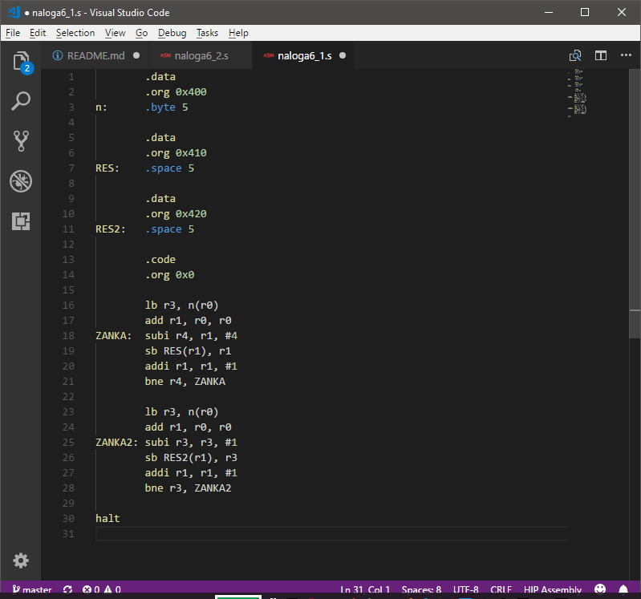

# HIP support for VS Code

## Features
This This VSCode extension provides basic MIPS colorization and snippets support.

# Sample

# Release Notes

## 0.0.1

* Initial release

## Disclaimer
This extension is based on kdarkhan's [vscode-mips-support](https://github.com/textmate/mips.tmbundle) extension.
